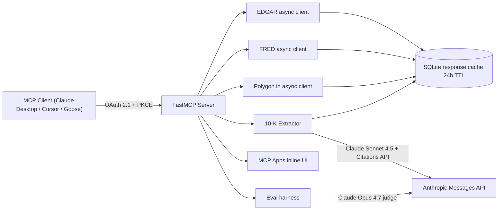

# mcp-financial-data

> An MCP server (spec **2025-11-25**) for **SEC EDGAR + FRED + Polygon.io** with
> **OAuth 2.1**, a **citation-grounded 10-K extractor** powered by Claude
> Sonnet 4.5, and an **MCP Apps inline UI** for the extracted summary.
>
> Anchor audience: Anthropic Forward Deployed Engineering, Bridgewater /
> Citadel / Anthropic Finance teams.

[](https://github.com/SebAustin/mcp-financial-data/actions/workflows/ci.yml)
[](https://github.com/SebAustin/mcp-financial-data/actions/workflows/eval-nightly.yml)
[](https://www.python.org/downloads/release/python-3120/)
[](LICENSE)
[](https://github.com/SebAustin/mcp-financial-data/releases/tag/v0.1.0)

> **About:** MCP server for SEC EDGAR + FRED + Polygon with OAuth 2.1, a
> citation-grounded 10-K extractor, and MCP Apps inline UI — built for
> Anthropic FDE, Bridgewater / Citadel quant, and Cursor FDE reviewers.

## Demo

**Loom (60s):** _Paste your recording URL here after filming._

| Step | Command |
| --- | --- |
| Prep | `make demo-prep` — offline smoke eval + copy-paste terminal commands |
| Record | Follow [`docs/demo/loom-tenk-summary-card.md`](docs/demo/loom-tenk-summary-card.md) |
| Server | `make serve` in one terminal; `make oauth-dev` for a dev Bearer token |

Flow on camera: OAuth (`401` → authorized `/mcp`) → `tenk.extract_section` →
**TenKSummaryCard** citation pills → `evals/runs/<run_id>/summary.json` →
green CI on GitHub.

## Why this exists

Financial-services AI work consistently fails the same audit checklist:

1. The agent answered with a number, but the citation pointed at the wrong
   filing.
2. The agent dropped a fact silently when the source didn't support it.
3. The MCP integration didn't validate JWT scopes per request.
4. The eval harness wasn't deterministic, so the regression yesterday is
   indistinguishable from a flaky judge today.

Every one of these is a hard constraint in this repo, enforced in CI.

## Architecture



## Quickstart

```bash
git clone https://github.com/SebAustin/mcp-financial-data.git
cd mcp-financial-data
cp .env.example .env   # fill in API keys
make setup             # uv sync + pre-commit install
make ci                # lint + typecheck + tests + smoke eval (offline)
make serve             # run the MCP server on $MCP_HOST:$MCP_PORT
```

## What's in the box

| Surface | Tool / endpoint | Notes |
| --- | --- | --- |
| MCP tool | `edgar.list_filings` | Recent SEC filings for a CIK. |
| MCP tool | `edgar.company_facts` | XBRL facts (us-gaap concepts). |
| MCP tool | `fred.series` | FRED economic time series. |
| MCP tool | `polygon.aggregates` | OHLCV aggregate bars. |
| MCP tool | `tenk.extract_section` | Claude-grounded 10-K claims with citations. |
| MCP App | `tenk-summary-card` | Inline UI rendering the extractor output. |
| OAuth   | RFC 6750 resource server | Validates JWT against external IdP. |

## Eval targets (W1)

The eval harness writes per-case JSONL plus a summary JSON to
`evals/runs/<run_id>/`. CI runs `--smoke --offline` on every PR; nightly
CI runs `--full --budget 5 --min-judge-score 0.85` against live APIs.

| Metric | W1 target | W1 actual | Source of truth | Notes |
| --- | --- | --- | --- | --- |
| Smoke pass rate | 5 / 5 | **5 / 5** | `evals/cases/seed.jsonl` | Offline fixtures. |
| Mean exec-accuracy | ≥ 0.95 | **1.00** (offline) / **0.80** (live) | `evals/metrics.py::exec_accuracy` | Live MSFT XBRL multi-row list match — tracked in follow-on issues. |
| Mean citation coverage | = 1.00 | **1.00** | `evals/metrics.py::citation_coverage` | Required for `tenk.*`. |
| Mean judge score (offline) | ≥ 0.90 | **1.00** | `evals/metrics.py::judge_with_stub` | 0.5·exec + 0.5·citation. |
| Mean judge score (live full) | ≥ 0.85 | **0.93** | `evals/judge.py::judge_with_claude` | Opus 4.7 five-axis rubric. |
| P50 latency (smoke) | ≤ 50 ms | **< 1 ms** | harness `latency_ms` | Offline only. |
| Total cost / smoke run | $0.00 | **$0.00** | harness `total_cost_usd` | `--offline` enforced. |
| Total cost / live full run | ≤ $5.00 | **$0.08** | harness `total_cost_usd` | `--budget 5` gate. |
| Coverage gate (src/) | ≥ 85% | **~87%** | `pytest --cov-fail-under=85` | mypy `--strict` also gates. |

### Latest `--full` runs (git `b8a4ba3`, 2026-05-21)

Reproduce offline:

```bash
uv run python -m mcp_financial_data.evals.harness --full --offline
```

Reproduce live (requires `.env` secrets; ~$0.08 per run):

```bash
uv run python -m mcp_financial_data.evals.harness --full --budget 5 --min-judge-score 0.85
```

| Run | `run_id` | Pass | mean exec-acc | mean citation | mean judge | cost USD |
| --- | --- | --- | --- | --- | --- | --- |
| Offline full | `20260521T114816Z_b8a4ba3` | 5 / 5 | 1.00 | 1.00 | 1.00 | 0.00 |
| Live full | `20260521T114826Z_b8a4ba3` | 5 / 5 | 0.80 | 1.00 | 0.93 | 0.08 |

See [CHANGELOG.md](CHANGELOG.md) for the `v0.1.0` release notes.

## Hard constraints (skim before contributing)

- **Citations are non-optional** for the 10-K extractor. Every
  `CitedClaim.text` carries at least one `Citation`. Uncited model output
  is dropped or moved to `notes` with `[INFERENCE]`. See
  [`docs/adr/0003-citations-required-for-extracted-claims.md`](docs/adr/0003-citations-required-for-extracted-claims.md).
- **EDGAR Fair Access** is enforced. Every request carries the
  `EDGAR_USER_AGENT` env value. Process rate limit ≤ 10 req/sec.
- **Spend cap.** `MAX_API_SPEND_USD` defaults to 50. Enforced in extractor
  and harness.
- **No `requests`, no `print()`, no `subprocess shell=True`, no bare `except`.**
- **OAuth 2.1 RS only.** This server validates JWTs; it is never the IdP.
  See [`docs/adr/0004-oauth21-as-resource-server.md`](docs/adr/0004-oauth21-as-resource-server.md).

## Layout

```
src/mcp_financial_data/      # the package
  server.py                  # FastMCP entrypoint
  auth/oauth.py              # OAuth 2.1 RS primitives
  tools/{edgar,fred,polygon} # async API clients
  extractors/tenk.py         # citation-grounded 10-K extractor
  apps/ui.py                 # MCP Apps inline UI registration
  evals/{harness,metrics}    # eval harness (--smoke / --full / --offline)
tests/{unit,integration}     # pytest, 85% gate, integration skipped by default
evals/cases/seed.jsonl       # 5 hand-authored eval cases
evals/runs/                  # per-SHA harness output (gitignored)
docs/adr/                    # MADR architecture decisions
.github/                     # CI templates + issue/PR templates + dependabot
```

## References

1. [Model Context Protocol — specification 2025-11-25][mcp-spec]
2. [SEC EDGAR — accessing data fairly (User-Agent + 10/sec)][edgar-fair]
3. [FRED API documentation][fred-api]
4. [Polygon.io REST API][polygon-rest]
5. [Anthropic Citations API][anthropic-citations]

[mcp-spec]: https://modelcontextprotocol.io/specification/2025-11-25
[edgar-fair]: https://www.sec.gov/os/accessing-edgar-data
[fred-api]: https://fred.stlouisfed.org/docs/api/fred/
[polygon-rest]: https://polygon.io/docs/rest
[anthropic-citations]: https://docs.anthropic.com/en/docs/build-with-claude/citations

## License

MIT. See [LICENSE](LICENSE).
